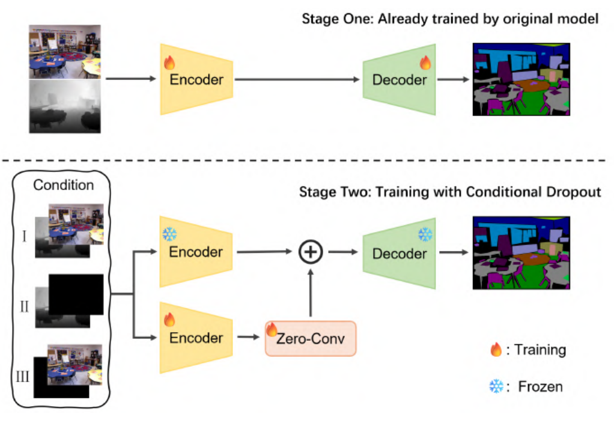

# Toward Reliable RGB-D Semantic Segmentation

This repository contains the code release for:

**Toward Reliable RGB-D Semantic Segmentation: Handling Missing Modalities via Condition Dropout**

The project studies a practical failure case in RGB-D semantic segmentation: most RGB-D models are trained with the assumption that RGB and depth are always available, but real systems can lose one modality because of sensor failure, occlusion, glare, low light, misalignment, or attack. The paper shows that strong full-modal models can collapse under RGB-only or depth-only inputs, even when the remaining modality still contains useful semantic cues.

The proposed solution, **Condition Dropout (ConD)**, is a continued-training strategy that adapts pretrained RGB-D semantic segmentation models to three deployment conditions:

- complete RGB-D input
- RGB-missing input
- depth-missing input

ConD starts from an existing checkpoint, freezes the original encoder and decoder, copies the encoder into a trainable auxiliary branch, and injects auxiliary features back into the frozen feature stream through zero-initialized 1x1 convolutions. This preserves the original full-modality behavior at the start of continued training while learning robust residual corrections for missing-modality inputs.

## Method Flow



The method overview above is cropped from Fig. 2 of the paper. Stage 1 reuses an already trained RGB-D segmentation model. Stage 2 freezes the original encoder/decoder, samples complete or missing-modality inputs through Condition Dropout, trains copied encoders, and injects the copied-encoder outputs through zero-initialized 1x1 convolutions before decoding.

## Repository Layout

```text
RGBD-MMCD/
+-- DFormer/          # DFormer-based RGB-D semantic segmentation code
+-- Sigma_CD/         # Sigma-based RGB-D semantic segmentation code
+-- figures/          # README diagrams
+-- BEST_CHECKPOINTS.md
+-- README.md
```

Datasets, logs, visualization dumps, temporary outputs, CUDA installers, and native build artifacts are excluded. Model weights and checkpoints are tracked with Git LFS.

## Main Results

The paper evaluates ConD on **NYU-Depth V2** and **SUN RGB-D** with **DFormer-B** and **Sigma-S**. Metrics are mIoU and mAcc. The table below summarizes the main mIoU results from Table I of the paper.

| Dataset | Model | Complete RGB-D | RGB Missing | Depth Missing | Average | Avg. Drop |
| --- | --- | ---: | ---: | ---: | ---: | ---: |
| NYUv2 | DFormer-B w/o ConD | 55.6 | 25.5 | 35.2 | 38.8 | -25.3 |
| NYUv2 | DFormer-B w/ ConD | **55.7** | **43.5** | **48.3** | **49.2** | **-9.8** |
| NYUv2 | Sigma-S w/o ConD | 56.6 | 13.0 | 50.3 | 40.0 | -25.0 |
| NYUv2 | Sigma-S w/ ConD | **57.2** | **41.5** | **52.9** | **50.5** | **-10.0** |
| SUN | DFormer-B w/o ConD | 51.2 | 13.6 | 41.7 | 35.5 | -23.6 |
| SUN | DFormer-B w/ ConD | **51.4** | **38.1** | **45.3** | **44.9** | **-9.7** |
| SUN | Sigma-S w/o ConD | 51.9 | 11.6 | 46.0 | 36.5 | -23.1 |
| SUN | Sigma-S w/ ConD | **52.9** | **37.8** | **50.1** | **46.9** | **-9.0** |

Key observations:

- ConD greatly reduces missing-modality degradation. On NYUv2, the DFormer-B average mIoU drop improves from -25.3 to -9.8, and Sigma-S improves from -25.0 to -10.0.
- The full-modality case is preserved or slightly improved. For example, Sigma-S improves from 56.6 to 57.2 mIoU on NYUv2 and from 51.9 to 52.9 mIoU on SUN.
- Robustness improves across both tested architectures and both datasets, suggesting that ConD is not tied to a single backbone.

## Ablation Summary

The ablation in Table II shows that the three ConD components are complementary:

| Setting | Modality Dropout | Encoder Copy | Freeze Original | Complete mIoU | Missing RGB mIoU | Missing Depth mIoU | Average mIoU |
| --- | --- | --- | --- | ---: | ---: | ---: | ---: |
| Baseline | No | No | No | 51.2 | 13.6 | 41.7 | 35.5 |
| Dropout only | Yes | No | No | 47.5 | 25.7 | 43.5 | 38.9 |
| Dropout + copy | Yes | Yes | No | 48.8 | 27.9 | 44.1 | 40.3 |
| Full ConD | Yes | Yes | Yes | **51.4** | **38.1** | **45.3** | **44.9** |

Dropout alone improves missing-modality robustness but hurts complete-input accuracy. Copying the encoder adds adaptation capacity, while freezing the original model preserves the pretrained full-modality representation.

## Checkpoints

The available large model files are tracked with Git LFS. See [`BEST_CHECKPOINTS.md`](BEST_CHECKPOINTS.md) for the exact files included in this release.

Locally verified DFormer evaluation:

```powershell
cd DFormer
$env:PYTHONPATH = (Get-Location).Path
E:\libraries\Anaconda\envs\rgbd-mmcd\python.exe utils\eval.py `
  --config=local_configs.NYUDepthv2.DFormer_Base `
  --continue_fpath=checkpoints\NYUD_CD\epoch-292_miou_55.05.pth `
  --gpus 1 --no-mst --no-sliding --no-compile --no-syncbn
```

The verified NYU-Depth V2 DFormer checkpoint reaches approximately **55.14 mIoU**, matching the recorded checkpoint performance.

## Citation

```bibtex
@inproceedings{zhu2026reliable,
  title={Toward Reliable RGB-D Semantic Segmentation: Handling Missing Modalities via Condition Dropout},
  author={Zhu, Xuchen and Wei, Yajuan and Hao, Shuang and Jiang, Jiwei and Mao, Guanxiang and Ren, Fang},
  booktitle={ICME Workshop},
  year={2026}
}
```
